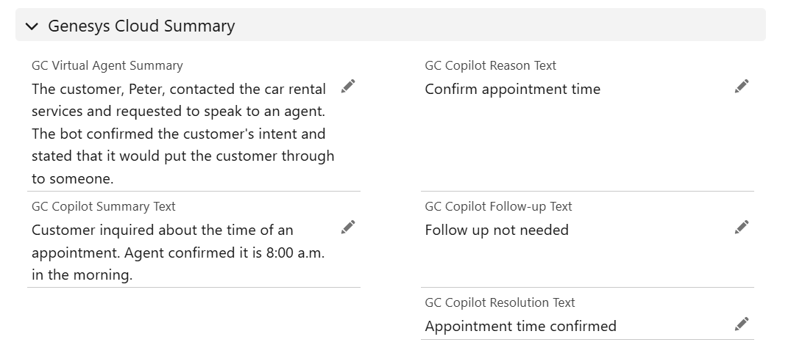

# CX Cloud - Genesys Cloud Agent Copilot Backend Integration

**Disclaimer: This configuration guide is intended for research and demonstration purposes. Ensure all configurations are thoroughly tested before deployment to production environments. Verify all security, field mappings, and integration settings according to your organization's standards.**

## Overview

This guide provides step-by-step instructions for configuring the Genesys Cloud Agent Copilot integration with Salesforce. The setup enables automatic population of AI-generated summaries and insights data from Genesys Cloud into Salesforce objects.

This integration is designed to work in conjunction with the **[CX Cloud After Call Work (ACW) Component](https://help.genesys.cloud/articles/configure-the-after-call-work-component/)**. The ACW Component serves as the **frontend** of the integration, where agents review, edit, and confirm AI-generated summaries before clicking the "Done" button. The trigger, Architect workflow, and data actions documented in this guide are the **backend**: they detect the ACW completion event and push the (potentially edited) summary data to Salesforce.

The integration supports two Salesforce objects:
1. **`genesysps__Experience__c`** - Custom object for messaging interactions
2. **`VoiceCall`** - Standard object for voice call interactions

## Features

* **CX Cloud ACW Component Integration**: Works with the [ACW Component](https://help.genesys.cloud/articles/configure-the-after-call-work-component/) as the agent-facing frontend
* **Edited Summary Support**: Automatically detects and prioritizes agent-edited summaries over AI-generated originals
* **Automated Data Synchronization**: Real-time data flow from Genesys Cloud to Salesforce
* **Architect Workflow Automation**: Trigger-based workflow execution
* **Multi-Channel Support**: Works with both voice calls and messaging conversations
* **Agent Transfer Support**: Works with blind transfers and consultation transfers

## Prerequisites

Before beginning the setup, ensure you have:

* Genesys Cloud organization with Copilot and CX Cloud add-on enabled
* CX Cloud enabled Salesforce org
* [CX Cloud ACW Component](https://help.genesys.cloud/articles/configure-the-after-call-work-component/) configured and enabled for agents
* Necessary GC permissions to create data actions and architect workflows
* Necessary SF permissions to create custom fields and configure integrations

## Architecture Overview

The integration has two layers:

| Layer | Components | Role |
|-------|-----------|------|
| **Frontend** | [CX Cloud ACW Component](https://help.genesys.cloud/articles/configure-the-after-call-work-component/) | Agent-facing UI where agents review, edit, and confirm AI-generated summaries before clicking "Done" |
| **Backend** | Trigger + Architect Workflow + Data Actions | Detects the ACW completion event, retrieves summary data (including any edits), and pushes it to Salesforce |

The integration follows this data flow:

1. **Interaction Completion**: A voice call or messaging conversation ends in Genesys Cloud
2. **Agent Review (Frontend)**: The agent sees the AI-generated summaries in the CX Cloud ACW Component. They can review and optionally edit the summary before clicking "Done"
3. **Trigger Activation (Backend)**: The configured trigger detects the ACW completion event (`v2.detail.events.conversation.{id}.acw`)
4. **Workflow Execution (Backend)**: The Architect workflow executes, calling the imported data actions
5. **Copilot Data Retrieval (Backend)**: Data actions fetch Copilot-generated summaries and insights, including any edits made by the agent in the ACW Component
6. **Salesforce Update (Backend)**: Data is synchronized to the appropriate Salesforce object fields
7. **Data Availability**: Copilot data becomes visible in Salesforce record (within a few seconds, depending on the Workflow configuration)

## Setup Instructions

### Step 1: Create Custom Fields in Salesforce

You need to create custom fields on both the `genesysps__Experience__c` and `VoiceCall` objects to store Copilot-generated data.

#### How to Create Custom Fields in Salesforce

If you're new to creating custom fields in Salesforce, follow these steps:

1. Navigate to **Setup** (click the gear icon in the upper-right corner, see screenshot below)
2. In the Quick Find box, type "Object Manager" and select it
3. Find and click on the object you want to add fields to (e.g., `genesysps__Experience__c` or `VoiceCall`)
4. Click on **Fields & Relationships** in the left sidebar
5. Click the **New** button in the upper-right corner
6. Select the appropriate field type:
   - For **Text** fields: Select "Text" and click **Next**
   - For **Long Text Area** fields: Select "Text Area (Long)" and click **Next**
7. Enter the **Field Label** and **Field Name** (API Name) as specified in the tables below
8. For Text fields: Set the **Length** to 255
9. For Long Text Area fields: Set the **Length** to 32768 and leave **# of Visible Lines** at default (3)
10. Click **Next** through the remaining screens
11. Set **Field-Level Security** (typically "Visible" for all profiles for demo purposes, or customize as needed)
12. Click **Next** to add the field to page layouts (you can adjust this later)
13. Click **Save**

Repeat this process for each field listed in the tables below.


#### Fields for genesysps__Experience__c Object

Create the following custom fields on the `genesysps__Experience__c` object:

| Field Label | API Name | Field Type | Length/Size |
|-------------|----------|------------|-------------|
| genesysps Interaction Id | `genesysps__Interaction_Id__c` | Text | 255 |
| GC Virtual Agent Summary | `GC_Virtual_Agent_Summary__c` | Long Text Area | 32,768 |
| GC Copilot summary text | `GC_Copilot_summary_text__c` | Long Text Area | 32,768 |
| GC Copilot reason text | `GC_Copilot_reason_text__c` | Long Text Area | 32,768 |
| GC Copilot followup text | `GC_Copilot_followup_text__c` | Long Text Area | 32,768 |
| GC Copilot resolution text | `GC_Copilot_resolution_text__c` | Long Text Area | 32,768 |

#### Fields for VoiceCall Object

Create the following custom fields on the `VoiceCall` object:

| Field Label | API Name | Field Type | Length/Size |
|-------------|----------|------------|-------------|
| GC Interaction Id | `GC_Interaction_Id__c` | Text | 255 |
| GC Virtual Agent Summary | `GC_Virtual_Agent_Summary__c` | Long Text Area | 32,768 |
| GC Copilot summary text | `GC_Copilot_summary_text__c` | Long Text Area | 32,768 |
| GC Copilot reason text | `GC_Copilot_reason_text__c` | Long Text Area | 32,768 |
| GC Copilot followup text | `GC_Copilot_followup_text__c` | Long Text Area | 32,768 |
| GC Copilot resolution text | `GC_Copilot_resolution_text__c` | Long Text Area | 32,768 |

#### Add Fields to Page Layouts

After creating the custom fields, you need to add them to the page layouts so users can view the data:

1. Still in **Object Manager**, select the object (e.g., **genesysps__Experience__c**)
2. Click on **Page Layouts** in the left sidebar
3. Click on the page layout name you want to edit (typically "Experience Layout" or "VoiceCall Layout")
4. In the page layout editor, find the custom fields in the top palette
5. Drag and drop a new section (e.g., "Genesys Cloud Copilot Data" section), and put each newly created field onto it (see screenshot below)
6. Click **Save** when finished


Repeat the page layout steps for both the **genesysps__Experience__c** and **VoiceCall** objects.

### Step 2: Configure Conversation Field Mapping

Configure the Genesys Cloud Conversation Field Mapping to ensure proper data synchronization:

1. In Salesforce, navigate to the **Genesys Cloud Voice CX Cloud** package configuration
   - Go to **Setup** → **Installed Packages**
   - Find and click **Genesys Cloud Voice CX Cloud**
   - Click **Configure** or access the configuration settings
2. Locate the **"Genesys Cloud Conversation Field Mapping"** section
3. Map the following field:
   * **Source Field**: `Conversation.ConversationId`
   * **Target Field**: `GC_Interaction_Id__c` (VoiceCall field)
4. Click **Save** to apply the mapping


This mapping ensures that the Genesys Cloud conversation ID is properly captured in the VoiceCall record.

### Step 3: Import and Publish Genesys Cloud Data Actions

Import the required data actions that enable communication between Salesforce and Genesys Cloud:

1. Log in to your **Genesys Cloud** organization
2. Navigate to **Admin** → **Integrations** → **Data Actions**
3. Click the **Import Action** button in the upper-right corner
4. Select the provided data action JSON files
5. Import all provided data action configurations
6. Test each data action with actual data to validate that they work as expected
7. For each imported data action, click the **Publish** button to make it available for use

**Note**: Ensure all data actions are in a "Published" state before proceeding to the next step.

### Step 4: Import and Configure Architect Workflow

Set up the Architect workflow that triggers the Copilot data synchronization:

1. Log in to **Genesys Cloud Architect**
   - Navigate to **Admin** → **Architect**
2. Select the appropriate workflow type from the left menu (**Workflow**)
3. Click the **Import** button option in the dropdown close to the "Save" button
4. Select the provided Architect workflow file (.i3workflow file)
5. Click **Import** to upload the workflow
6. Once imported, locate the workflow in your list and click on its name to open it for editing
7. **Reselect all data actions** (this is critical):
   - Scroll through the workflow and locate each **Call Data Action** task
   - Click on each data action task to open its configuration
   - In the data action dropdown, reselect the corresponding data action you imported and published in Step 3
   - Verify the input and output mappings are correct
   - Repeat for every data action in the workflow
8. Check that the workflow shows **no errors** (look for red error icons or the error panel at the bottom)
9. Click **Save** to save your changes
10. Click **Publish** to make the workflow active


**Important**: By default the Workflow is configured to wait 5 seconds at the beginning to make sure we give enough time to the LLM to build the summaries.

### Step 5: Create and Enable the Trigger

Configure the trigger that initiates the Copilot data synchronization process:

1. In **Genesys Cloud Architect**, navigate to **Triggers**
   - From the Architect home page, click on **Triggers** in the left navigation menu
2. Click the **Add Trigger** button
3. Configure the trigger settings based on the provided "Trigger config" reference:
   
   **Basic Settings:**
   - **Name**: Enter a descriptive name (e.g., "Copilot SF Data Push")
   - **Description**: Add a description of the trigger's purpose
   
   **Event Configuration:**
   - **Topic**: `v2.detail.events.conversation.{id}.acw`. This event fires when the agent clicks the **"Done"** button in the CX Cloud ACW Component, ensuring that any edits made by the agent during the ACW phase are captured before pushing to Salesforce. Note: this topic may duplicate Salesforce API callouts when there is more than one agent involved in the interaction, but it is the safest way to ensure that in case the agent edits the summary data, we push the edited data, not the original one.
   
   **Workflow Association:**
   - **Target**: Select "Workflow"
   - **Workflow**: Choose the Architect workflow you imported and configured in Step 4
   
4. Review all settings to ensure they match the reference configuration
5. Click **Save**
6. Toggle the trigger status to **Enabled** (the toggle switch should turn green/active)


**Verification**: After enabling the trigger, you should see the "Active" radio button on in the general "Triggers" page.

### Step 6: Testing the Integration

After completing the configuration, test the integration with live interactions:

#### Testing Voice Calls

1. Place a test voice call through Genesys Cloud. That test call must hit first a Virtual Agent with summarization turned on, and then, the VA must transfer to the agent at some point. In both segments of the conversation, make sure to reproduce a long conversation enough to produce a summary (several sentences each will do it)
2. Complete the call and ensure the agent enters After Call Work (ACW)
3. Wait a few seconds (by default the Workflow is configured to 5 seconds) for data synchronization
4. In Salesforce, navigate to the corresponding **VoiceCall** record
5. Verify that Copilot-generated data appears in the custom fields:
   - `GC_Copilot_summary_text__c` should contain the conversation summary
   - `GC_Copilot_reason_text__c` should contain the reason for contact
   - `GC_Copilot_resolution_text__c` should contain the resolution details
   - `GC_Copilot_followup_text__c` should contain follow-up actions

#### Testing Messaging Conversations

1. Initiate a test messaging conversation through Genesys Cloud
2. Complete the conversation and ensure proper wrap-up
3. Wait a few seconds (by default the Workflow is configured to 5 seconds) for data synchronization
4. In Salesforce, navigate to the corresponding **genesysps__Experience__c** record
5. Verify that Copilot-generated data appears in the custom fields (same fields as voice)


### Edited Summary Behavior & Known Limitations

The Architect workflow is designed to prioritize **edited** summary data over AI-generated originals. When an agent edits a summary field in the **[CX Cloud ACW Component](https://help.genesys.cloud/articles/configure-the-after-call-work-component/)** before clicking "Done", the workflow will detect and use the edited version; otherwise, it falls back to the original AI-generated value.

#### Scenario 1: No Edits (Works as Expected)

When the agent **does not edit** any summary fields, all Salesforce fields are populated independently with the original AI-generated values:

| Salesforce Field | Source | Example Value |
|------------------|--------|---------------|
| **GC Virtual Agent Summary** | `virtualAgentSegment.text` | _"The customer, Peter, contacted the car rental services..."_ |
| **GC Copilot Summary Text** | `agentSegment.text` | _"Customer inquired about the time of an appointment..."_ |
| **GC Copilot Reason Text** | `agentSegment.reason.text` | _"Confirm appointment time"_ |
| **GC Copilot Follow-up Text** | `agentSegment.followup.text` | _"Follow up not needed"_ |
| **GC Copilot Resolution Text** | `agentSegment.resolution.text` | _"Appointment time confirmed"_ |

Each field is populated with its own distinct, AI-generated value. This is the ideal behavior.

![Non-edited summary in Salesforce]



#### Scenario 2: Agent Edits the Summary (Known API Limitation)

When the agent **edits the summary** via the CX Cloud ACW Component, a **known limitation of the Genesys Cloud API** affects how the data is distributed across Salesforce fields:

| Salesforce Field | Source | Behavior |
|------------------|--------|----------|
| **GC Copilot Summary Text** | `agentSegment.editedSummary.text` | Contains **ALL edits** consolidated into a single text blob (see explanation below) |
| **GC Copilot Reason Text** | `agentSegment.reason.text` | Falls back to **original** AI-generated value |
| **GC Copilot Follow-up Text** | `agentSegment.followup.text` | Falls back to **original** AI-generated value |
| **GC Copilot Resolution Text** | `agentSegment.resolution.text` | Falls back to **original** AI-generated value |

![Edited summary in Salesforce]!

[alt text](image-1.png)

#### Why This Happens

When an agent clicks "Edit" on the summary in the CX Cloud ACW Component, the UI presents a **single text box** containing all sections (Reason, Resolution, Action Items, Details). When the agent saves their edits and clicks "Done":

- **All changes are saved into `editedSummary.text`** as a single combined text block
- **`editedReason`, `editedResolution`, and `editedFollowup` remain empty** (`{}` or absent altogether)

This is the response structure returned by the Genesys Cloud API (`GET /api/v2/conversations/{conversationId}/summaries`):

```json
{
  "editedSummary": {
    "text": "Reason for call:\nConfirm appointment time - EDIT\n\nResolution:\nAppointment time confirmed - EDIT\n\nAction items:\nFollow up not needed - EDIT\n\nDetails:\nCustomer inquired about...",
    "dateModified": "2026-02-18T17:05:52.648Z"
  },
  "editedReason": {},
  "editedResolution": {},
  "reason": { "text": "Confirm appointment time", ... },
  "followup": { "text": "Follow up not needed", ... },
  "resolution": { "text": "Appointment time confirmed", ... }
}
```

Because `editedReason`, `editedResolution`, and `editedFollowup` are empty objects (no `.text` property), the workflow correctly falls back to the original AI-generated values for those fields. Meanwhile, `editedSummary.text` contains the full edited content, including the agent's changes to reason, resolution, and followup, all within a single text block.

> **Note**: This is a Genesys Cloud API behavior, not a workflow bug. The Architect workflow correctly implements the prioritization logic: _use edited if available, otherwise fall back to original_. The limitation is that the API does not split the agent's edits into individual `editedReason`, `editedFollowup`, and `editedResolution` fields.

### Architect Workflow Logic (Deep Dive)

This section documents how the Architect workflow is structured and how each expression handles the various scenarios that can arise from the Genesys Cloud API response.

#### High-Level Workflow Steps

The workflow follows this execution order:

```
1. WAIT 5 seconds (give the LLM time to generate summaries)
       │
2. SWITCH on Flow.mediaType
       |-- VOICE: Call "Get VoiceCall Ids by InteractionId" -> State.voiceCallIds
       |-- MESSAGE: Call "Get Experience Ids by InteractionId" -> State.experienceIds
       +-- Default: End Workflow
       │
3. Call "Get Conversation Summary Data v2" -> State.VASegments, State.agentSegments
       │
4. DECISION: Is State.agentSegments empty?
       |-- YES: Parse only VA segments into State.agentSegmentsArray (fallback scenario)
       +-- NO:  Parse both VA and agent segments into their respective arrays
       │
5. LOOP over State.agentSegmentsArray (one iteration per agent segment)
       │
       +-- SWITCH on Flow.mediaType
             |-- VOICE: Call "Update VoiceCall by VoiceCallId with summary info"
             |-- MESSAGE: Call "Update Experience by ExperienceId with summary info"
             +-- Default: End Workflow
       │
6. End Workflow
```

#### Expression Logic for Each Input Field

The workflow sends **6 input fields** to the Salesforce update data action. Each field uses a specific expression to determine which value to send:

##### 1. `virtual_agent_summary` - Virtual Agent (Bot) Summary

```
If(IsNotSetOrEmpty(State.VASegmentsArray),
    NOT_SET,
    ToString(GetJsonObjectProperty(GetAt(State.VASegmentsArray, 0), "text"))
)
```

**Logic**: Simple two-level check. If the VA segments array is empty/missing, send `NOT_SET`. Otherwise, always take the `.text` from the first (index 0) virtual agent segment. There is no "edited" variant for the bot summary.

##### 2. `human_agent_summary` - Agent Copilot Summary Text

```
If(IsNotSetOrEmpty(State.agentSegmentsArray), NOT_SET,           // Level 1
  If(IsSet(segment.editedSummary),                                // Level 2
    If(IsSet(segment.editedSummary.text),                         // Level 3
      ToString(segment.editedSummary.text),                       //   YES -> use edited
      ToString(segment.text)                                      //   NO  -> use original
    ),
    ToString(segment.text)                                        // Property missing -> use original
  )
)
```

> Where `segment` is a shorthand for `GetAt(State.agentSegmentsArray, State.loopCounter)`

**Logic**: Three-level nested `If`. Falls back from `editedSummary.text` to `segment.text` (the original AI-generated summary).

##### 3. `Reason_Text` - Copilot Reason Text

```
If(IsNotSetOrEmpty(State.agentSegmentsArray), NOT_SET,           // Level 1
  If(IsSet(segment.editedReason),                                 // Level 2
    If(IsSet(segment.editedReason.text),                          // Level 3
      ToString(segment.editedReason.text),                        //   YES -> use edited
      ToString(segment.reason.text)                               //   NO  -> use original
    ),
    ToString(segment.reason.text)                                 // Property missing -> use original
  )
)
```

**Logic**: Same three-level pattern. Falls back from `editedReason.text` to `reason.text`.

##### 4. `Followup_Text` - Copilot Follow-up Text

```
If(IsNotSetOrEmpty(State.agentSegmentsArray), NOT_SET,           // Level 1
  If(IsSet(segment.editedFollowup),                               // Level 2
    If(IsSet(segment.editedFollowup.text),                        // Level 3
      ToString(segment.editedFollowup.text),                      //   YES -> use edited
      ToString(segment.followup.text)                             //   NO  -> use original
    ),
    ToString(segment.followup.text)                               // Property missing -> use original
  )
)
```

**Logic**: Same three-level pattern. Falls back from `editedFollowup.text` to `followup.text`.

##### 5. `Resolution_Text` - Copilot Resolution Text

```
If(IsNotSetOrEmpty(State.agentSegmentsArray), NOT_SET,           // Level 1
  If(IsSet(segment.editedResolution),                             // Level 2
    If(IsSet(segment.editedResolution.text),                      // Level 3
      ToString(segment.editedResolution.text),                    //   YES -> use edited
      ToString(segment.resolution.text)                           //   NO  -> use original
    ),
    ToString(segment.resolution.text)                             // Property missing -> use original
  )
)
```

**Logic**: Same three-level pattern. Falls back from `editedResolution.text` to `resolution.text`.

##### 6. `voiceCallId` / `experienceId` - Salesforce Record Identifier

```
State.voiceCallIds[State.loopCounter]    (VOICE path)
State.experienceIds[State.loopCounter]   (MESSAGE path)
```

**Logic**: Simple array index lookup. Each loop iteration corresponds to a different agent segment / Salesforce record.

#### Why Three Levels of Checking?

The three-level `IsSet` check is necessary because the Genesys Cloud API can return the edited properties in **three different states**:

| API Response State | Example JSON | Level 2 (`IsSet(editedX)`) | Level 3 (`IsSet(editedX.text)`) | Result |
|--------------------|-------------|----------------------------|--------------------------------|--------|
| **Property missing entirely** | _(field absent from JSON)_ | `false` - skip to fallback | _(not evaluated)_ | Uses original |
| **Property exists but empty** (`{}`) | `"editedReason": {}` | `true` - enter Level 3 | `false` - skip to fallback | Uses original |
| **Property exists with text** | `"editedReason": {"text": "..."}` | `true` - enter Level 3 | `true` - use edited | Uses edited |

Without Level 2, calling `GetJsonObjectProperty(editedX, "text")` on a `NOT_SET` value (missing property) would cause a **runtime crash** in Architect. Without Level 3, an empty object `{}` would also cause issues. The two-level guard makes sure the workflow can handle all possible API response variations.

#### All Possible Scenarios Matrix

Here is a matrix of all the possible API response scenarios and what the workflow writes to each Salesforce field:

| # | `editedSummary` | `editedReason` | `editedFollowup` | `editedResolution` | SF Summary | SF Reason | SF Follow-up | SF Resolution |
|---|-----------------|----------------|-------------------|--------------------|-----------:|----------:|-------------:|-------------:|
| 1 | _(missing)_ | _(missing)_ | _(missing)_ | _(missing)_ | `segment.text` | `reason.text` | `followup.text` | `resolution.text` |
| 2 | `{}` | `{}` | `{}` | `{}` | `segment.text` | `reason.text` | `followup.text` | `resolution.text` |
| 3 | `{"text":"..."}` | `{}` | _(missing)_ | `{}` | **editedSummary.text** | `reason.text` | `followup.text` | `resolution.text` |
| 4 | `{"text":"..."}` | `{"text":"..."}` | `{"text":"..."}` | `{"text":"..."}` | **editedSummary.text** | **editedReason.text** | **editedFollowup.text** | **editedResolution.text** |
| 5 | `{}` | `{"text":"..."}` | `{}` | `{"text":"..."}` | `segment.text` | **editedReason.text** | `followup.text` | **editedResolution.text** |
| 6 | _Empty array_ | _Empty array_ | _Empty array_ | _Empty array_ | `NOT_SET` | `NOT_SET` | `NOT_SET` | `NOT_SET` |

- **Scenario 1**: No edited fields exist at all (property missing from JSON). All fields fall back to originals.
- **Scenario 2**: Edited fields exist but are empty objects. All fields fall back to originals.
- **Scenario 3**: The most common "edited" scenario (as seen in the CX Cloud ACW Component). The agent edited the summary, but reason/followup/resolution were not individually edited.
- **Scenario 4**: Ideal scenario where all fields have been individually edited.
- **Scenario 5**: Mixed scenario (some fields edited individually, others not).
- **Scenario 6**: No agent segments at all (the `agentSegmentsArray` is empty). All fields are set to `NOT_SET`.

#### VOICE vs MESSAGE Path Consistency

Both the **VOICE** and **MESSAGE** paths in the workflow use **identical expression logic** for all summary fields. The only differences are:

| Aspect | VOICE Path | MESSAGE Path |
|--------|-----------|-------------|
| **Salesforce Record ID** | `State.voiceCallIds[State.loopCounter]` | `State.experienceIds[State.loopCounter]` |
| **Data Action** | `Update VoiceCall by VoiceCallId with summary info` | `Update Experience by ExperienceId with summary info` |
| **Summary expressions** | _(identical)_ | _(identical)_ |

This keeps behavior consistent regardless of whether the interaction was a voice call or a messaging conversation.

---

#### Troubleshooting Tips

**If data doesn't appear immediately:**

* **Refresh the page**: Data synchronization takes a few seconds after the interaction ends. Refresh the Salesforce browser tab (press F5 or click the refresh button) to see updated data.

* **Check ACW status**: Ensure the agent has entered After Call Work (ACW) status, as this typically triggers the data synchronization.
  - In Genesys Cloud, verify the agent's status shows as "After Call Work" or "Wrap Up"

* **Review Execution History**: If data still doesn't appear after refreshing:
  1. Navigate to **Genesys Cloud Architect**
  2. Open the workflow you configured in Step 4
  3. Click on **Execution History** (typically in the upper-right area or under a menu)
  4. Filter by recent date/time to find executions related to your test
  5. Click on a specific execution to view detailed logs
  6. Look for any errors (red error icons) or failed steps in the execution logs
  7. Verify that the trigger fired and the workflow completed successfully (look for "Success" or "Completed" status)
  8. Check each data action step to see if it executed properly and returned expected data


## Agent Transfer Support

The integration is designed to handle complex interaction scenarios involving agent transfers, ensuring that Copilot data is properly captured for each agent participant in the conversation lifecycle.

### How Agent Transfers Work

When an interaction involves multiple agents (due to transfers, escalations, or consultations), the integration creates separate Salesforce records for each agent participant:

* **Voice Calls**: Each agent involved in the call gets their own `VoiceCall` record in Salesforce
* **Messaging Conversations**: Each agent involved gets their own `genesysps__Experience__c` record in Salesforce

**Supported Transfer Types:**
* **Blind Transfers**: The integration captures data for both the transferring agent and the receiving agent
* **Consultation Transfers**: The integration captures data for all agents involved in the consultation, including the original agent, consulting agent, and final receiving agent (if applicable)

Both transfer types are fully supported, ensuring complete visibility into multi-agent interactions.

### Data Distribution Across Agent Records

The Copilot-generated data is distributed across these records as follows:

#### Shared Data (Consistent Across All Agent Records)
* **`GC_Virtual_Agent_Summary__c`**: Contains the same virtual agent summary across all agent records
  - This is expected behavior since there is only one virtual agent segment in the conversation
  - All agents can view the same bot interaction context

#### Agent-Specific Data (Unique to Each Agent Record)
Each agent's record contains Copilot data specific to their segment of the conversation:
* **`GC_Copilot_summary_text__c`**: Summary specific to that agent's conversation segment
* **`GC_Copilot_reason_text__c`**: Reason for contact as understood during that agent's segment
* **`GC_Copilot_resolution_text__c`**: Resolution actions taken by that specific agent
* **`GC_Copilot_followup_text__c`**: Follow-up actions relevant to that agent's participation

### Example Scenario

**Customer Journey (Blind Transfer):**
1. Customer interacts with Virtual Agent (bot segment)
2. Virtual Agent transfers to Agent A (first agent segment)
3. Agent A performs a blind transfer to Agent B (second agent segment)

**Resulting Salesforce Records:**

| Record | Virtual Agent Summary | Copilot Summary | Copilot Reason | Copilot Resolution | Copilot Follow-up |
|--------|----------------------|-----------------|----------------|-------------------|-------------------|
| **Agent A's Record** | Bot conversation summary | Agent A's segment summary | Reason during Agent A's segment | Agent A's resolution actions | Agent A's follow-up notes |
| **Agent B's Record** | Bot conversation summary (same) | Agent B's segment summary | Reason during Agent B's segment | Agent B's resolution actions | Agent B's follow-up notes |

### Benefits of This Approach

* **Complete Context**: Each agent has visibility into the virtual agent interaction through the shared summary
* **Accurate Attribution**: Copilot insights are correctly attributed to the specific agent who handled that portion of the interaction
* **Audit Trail**: Maintains a complete record of each agent's contribution to the resolution
* **Reporting Flexibility**: Enables accurate performance metrics per agent, even in transferred interactions

### Important Considerations

* The `GC_Interaction_Id__c` field will contain the same conversation ID across all agent records for the same interaction
* Each record represents a distinct participant's view of the conversation
* Copilot data is generated based on what occurred during each agent's active participation in the conversation
* Virtual Agent summaries remain consistent because the bot interaction is a single, shared segment
* **Transfer Type Handling**:
  - **Blind Transfers**: Both the transferring and receiving agents get separate records with their respective Copilot data
  - **Consultation Transfers**: All participating agents (initiating agent, consulting agent, and any subsequent agents) receive their own records with segment-specific Copilot insights


## Key Configuration Files

* **Data Actions**: JSON configuration files for Genesys Cloud API integration
* **Architect Workflow**: Flow configuration for automated data synchronization
* **Trigger Configuration**: Event-based trigger settings for workflow execution
* **Field Mapping Configuration**: Salesforce field mapping definitions

## Post-Configuration Best Practices

* **Monitor Execution History**: Regularly review Architect workflow execution logs to identify any failures
* **Field-Level Security**: Configure appropriate field-level security for custom fields

## Support and Resources

For additional assistance:

* **Genesys Cloud Documentation**: [https://help.genesys.cloud](https://help.genesys.cloud)
* **Salesforce Help**: [https://help.salesforce.com](https://help.salesforce.com)
* **Architect Workflow Best Practices**:  [https://help.genesys.cloud/articles/work-with-workflows](https://help.genesys.cloud/articles/work-with-workflows)
* **Data Actions Reference**: [https://help.genesys.cloud/articles/about-the-data-actions-integrations](https://help.genesys.cloud/articles/about-the-data-actions-integrations)

---
